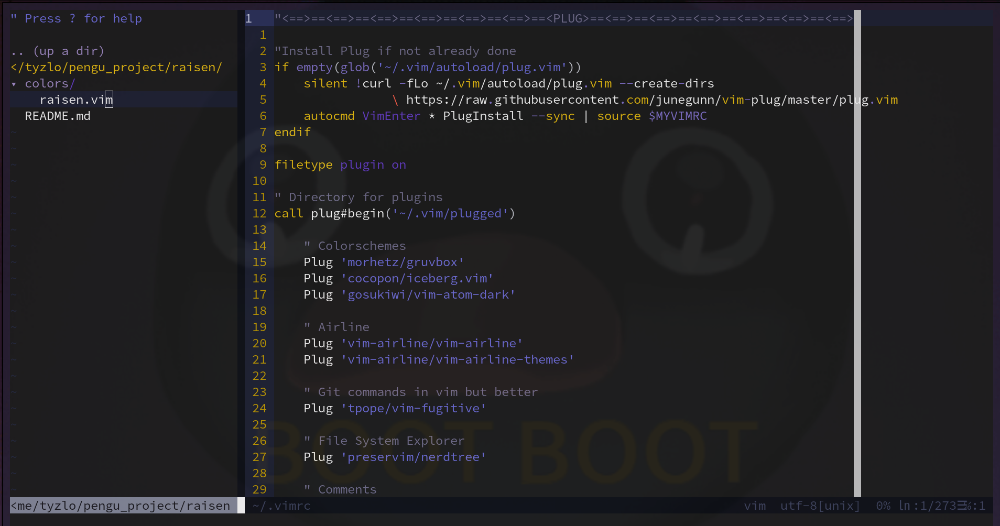

# RAISEN

## What is this ?

A simple colorscheme I made :3 (mainly to code in C)

It is inspired by the color palette of my genshin main uwu

I hope you will like it!

## ScreenshOwOt



## How to install it ?

### If you use Plug to manage your vim plugin 

Just add this line to your `.vimrc` file
```
Plug 'TCHEOUValentine/raisen'
```

### Else

Clone the repository
```
git clone https://github.com/TCHEOUValentine/raisen
```

In the `.vim/` directory 
- If you do not have a `colors/` create it

- Go in that directory

- Copy and paste the `raisen.vim` file there

## Use the colorscheme

### If you just want to look if you like it
Open vim and in `NORMAL MODE` type `:colorscheme raisen`

### If you want to use it by default
Add this line to your `.vimrc` file
```
colorscheme raisen
```

### The colorscheme does not work
Add this line to your `.vimrc` file
```
set termguicolors
```
