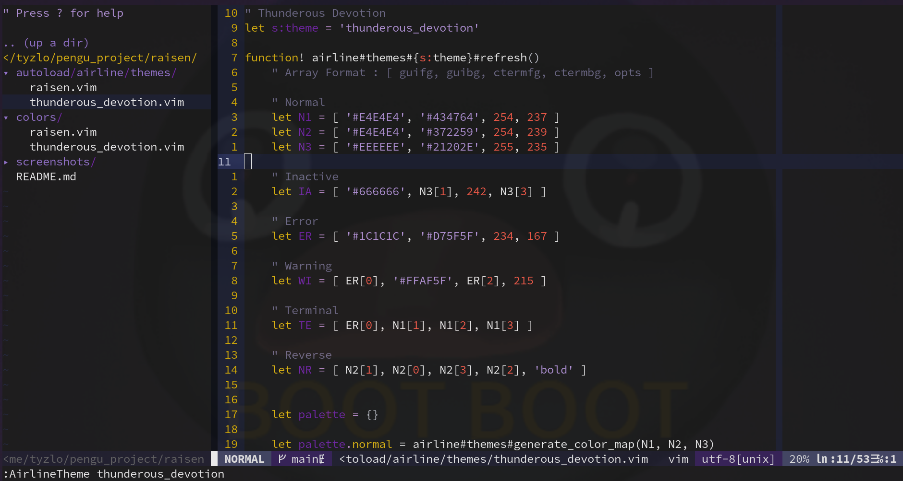

# RAISEN

## What is this ?

A simple colorscheme I made :3

I hope you will like it!

## ScreenshOwOt




## Inspiration
It is inspired by the color palette of my genshin main uwu

There is a purple variation because it is a pretty color :3

## Base code
The colorscheme base is the amazing [iceberg theme](https://github.com/cocopon/iceberg.vim) of [cocopon](https://github.com/cocopon) but I made a lot of changes and additions to it thanks to the [documentation](http://vimdoc.sourceforge.net/htmldoc/syntax.html).

The airline theme base is the awesome [minimalist theme](https://github.com/vim-airline/vim-airline-themes/blob/master/autoload/airline/themes/minimalist.vim). I just changed some colors...

## The colorscheme does not work
Add this line to your `.vimrc` file
```
set termguicolors
```
